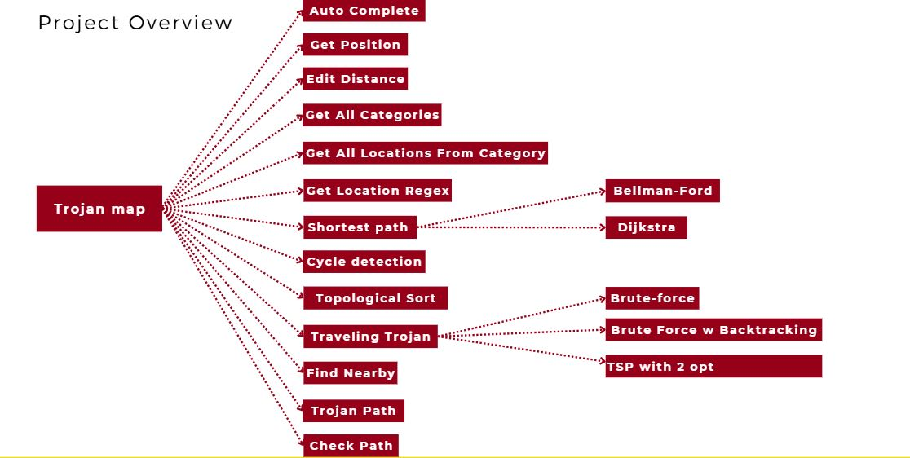
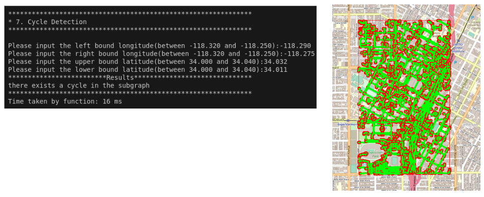

# EE538 Final Project - Fall 2024 - TrojanMap

# AUTHOR DETAILS
| Name                  	| Email            	| USC ID     	|
|-----------------------	|------------------	|------------	|
| NIVEDITHA MADEGOWDA 	            | madegowd@usc.edu 	| 9517006149 	|
| LEONARDO ROBLES       	| lroblesa@usc.edu 	|  	            |
2. Link youtube: [Youtube Video Link](https://www.youtube.com/watch?v=5uOlsDhjrDM&t=25s)

## Project Overview
The TrojanMap project is a comprehensive application designed to manage and analyze geographic data using graph-based approaches. It includes functionalities such as shortest path computation, traveling salesman problem solving, and data extraction using regular expressions. The project demonstrates practical applications of algorithms for solving real-world navigation and optimization problems, tailored for the USC area. The overview of different functionalities is as follows :

****************************************************************************************************
## Implemented Functionalities

### 1. Autocomplete

#### **Description**
The Autocomplete function retrieves all locations matching a given partial name (prefix). The function is case-insensitive, ensuring flexibility in user input.

#### **Implementation**
1. Converts the input prefix and all location names in the dataset to lowercase for case-insensitive matching.
2. Iterates through all nodes and checks if the location name starts with the given prefix using `substr`.
3. Returns all matching location names as a vector.

#### **Performance**
- **Time Complexity**: \O(n*m), where \(n\) is the number of locations and \(m\) is the average length of the location names.

****************************************************************************************************
### **Item 2. Find Location**

#### **Description**
Retrieves latitude, longitude, or ID of a location.

#### **Implementation**
- **`GetLat` and `GetLon`**:
  - Check if the given location ID exists in the dataset.
  - If it exists, return the latitude or longitude; otherwise, return `-1`.
- **`GetID`**:
  - Iterates through the dataset to find the ID of the location name.
  - Returns an empty string if the name does not exist.
#### **Performance**
- **Time Complexity**:  O (n), where n is number of locations/nodes.
-  Time taken: 1 ms

****************************************************************************************************
### **Item 2-2. Edit Distance**

#### **Description**
Calculates the minimum number of operations (insertions, deletions, substitutions) required to convert one string into another. Used in `FindClosestName`.

#### **Implementation**
1. Converts both input strings to lowercase for consistency.
2. Uses dynamic programming to populate a 2D matrix, where each cell represents the edit distance up to that point.
3. Returns the value at the bottom-right corner of the matrix as the result.
#### **Example**
- **Input**: `"Univercity"`
- **Output**: `"University of Southern California"`

#### **Performance**
- **Time Complexity**: (O(m * n)), where (m) and (n\) are the lengths of the two strings.

****************************************************************************************************
### **Item 3. Get All Categories**

#### **Description**
Returns all unique location categories from the dataset.

#### **Implementation**
1. Extracts attributes (categories) from all nodes and inserts them into a `std::set` to ensure uniqueness.
2. Converts the set into a vector for the output.

#### **Example**
- **Output**: `["restaurant", "bank", "school", ...]`

#### **Performance**
- **Time Complexity**: (O(m * n)), where (m) and (n\), where \(n\) is the number of locations and \(m\) is the average number of attributes per location.

---

****************************************************************************************************
### **Item 4. Get All Locations from a Category**

#### **Description**
The `GetAllLocationsFromCategory` function retrieves all locations belonging to a specific category. It filters the dataset to match the provided category and returns the corresponding location IDs.

#### **Implementation**
- Iterates through all nodes in the dataset.
- Checks if each node's `category` matches the given input.
- Adds the node IDs of matching locations to a results vector.
- #### **Performance**
- **Time Complexity**: \(O(n)\), where \(n\) is the number of locations in the dataset.

---

****************************************************************************************************
### **Item 5. Regular Expression Matching**

#### **Description**
The `GetLocationRegex` function filters location names based on a user-provided regular expression pattern. It enables users to dynamically query location names using flexible matching rules.

#### **Implementation**
1. Accepts a `std::regex` object as input, representing the pattern to match.
2. Iterates through all nodes in the dataset.
3. For each node:
   - Uses `std::regex_match` to check if the node's name matches the provided regex pattern.
4. Adds all matching location IDs to a results vector.
5. Returns the vector containing IDs of matching locations.
#### **Performance**
- **Time Complexity**: \(O(n * l)\), where:
  - \(n\) is the number of locations.
  - \(l\) is the average length of the location names.

#### **Error Handling**
- Invalid regular expressions throw a `std::regex_error`.
- The implementation catches this error and provides meaningful feedback to the user.

---

****************************************************************************************************
### Item 6. **Shortest Path**

#### **Description**
The `CalculateShortestPath` function computes the shortest path between two locations in the TrojanMap dataset using two algorithms:
1. **Dijkstra’s Algorithm**: Efficient for non-negative edge weights.
2. **Bellman-Ford Algorithm**: Handles graphs with negative edge weights but is slower compared to Dijkstra's.

#### **Implementation**
1. **Dijkstra’s Algorithm**:
   - Utilizes a priority queue (`std::priority_queue`) to explore the shortest paths greedily.
   - Maintains a `distance` map to store the shortest known distance to each node.
   - Updates the shortest distance of neighboring nodes iteratively.
   - Terminates when the target node is reached or all nodes are explored.

2. **Bellman-Ford Algorithm**:
   - Initializes distances from the source node to all nodes as infinity, except the source itself (set to 0).
   - Iteratively relaxes all edges in the graph for \(V-1\) iterations (\(V\) is the number of nodes).
   - Detects negative weight cycles by checking for updates after \(V-1\) iterations.

3. Path reconstruction:
   - Once the shortest distances are computed, backtrack using a `parent` map to reconstruct the path.

#### **Performance**
- **Dijkstra's Complexity**: \(O((n + m) \log n)\)  
- **Bellman-Ford Complexity**:O (n * m)

****************************************************************************************************
### Comparison of Dijkstra and Bellman Ford
#### **Comparison**
- **Dijkstra’s Algorithm**:
  - Faster for graphs with non-negative edge weights.
  - Suitable for most real-world navigation problems.
- **Bellman-Ford Algorithm**:
  - Handles graphs with negative edge weights.
  - Useful for detecting negative weight cycles but is computationally more expensive.

#### **Error Handling**
- Ensures the start and end locations are valid nodes in the graph.
- For Bellman-Ford, checks for the presence of negative weight cycles and handles them gracefully.

### Additional Notes:
- **Practical Application**: Used for navigation tasks, such as finding the quickest route between two locations.
- **Optimization**: Dijkstra’s implementation leverages a min-heap for efficient priority queue operations.
- **Use Case**:  
  - Input locations can be selected by name or ID. The output path is displayed as a vector of location names, along with the total distance.

The following image shows the time taken of every function according to the destination.

****************************************************************************************************
### **Item 7. Cycle Detection**

#### **Description**
The `CycleDetection` function determines whether there is a cycle in a subgraph defined by specific geographical bounds (latitude and longitude).

#### **Implementation**
1. **Extracting the Subgraph**:
   - The function filters the graph to include only nodes within the specified geographical bounds (left, right, top, and bottom).
   - Constructs an adjacency list for these nodes.

2. **Depth-First Search (DFS)**:
   - Implements a recursive DFS approach to traverse the subgraph.
   - Maintains a `visited` set to track visited nodes and a `parent` map to detect back edges, indicating cycles.
   - During traversal:
     - If a node is revisited (and it is not the direct parent), a cycle is detected.
     - Otherwise, traversal continues.

3. **Result**:
   - If a cycle is found during DFS, the function returns `true`.
   - If the DFS completes without finding a cycle, the function returns `false`.
--> Time complexity: O (n)
--> Time taken: 16 ms

#### **Performance**
- **Time Complexity**: \(O(V + E)\), where:
  - \(V\) is the number of nodes in the subgraph.
  - \(E\) is the number of edges in the subgraph.
- The adjacency list representation ensures efficient traversal.

  #### **Error Handling**
- Ensures the input bounds are valid.
- Handles edge cases where the subgraph is empty or contains isolated nodes (no edges).

### Additional Notes:
- **Practical Application**: Useful in detecting loops in road networks or identifying redundant paths.
- **Optimization**:
  - By limiting the graph to a specific geographical area, the function reduces unnecessary computations on the entire graph.
- **Use Case**:
  - In urban planning or traffic analysis, cycles might indicate problematic areas where vehicles could loop indefinitely or redundant roads exist.
See the image for reference

****************************************************************************************************

### **Item 8. Topological Sort**

#### **Description**
The `TopologicalSort` function determines a linear ordering of nodes in a Directed Acyclic Graph (DAG) such that for every directed edge \( (u, v) \), node \( u \) appears before \( v \) in the ordering. This is particularly useful for tasks like task scheduling or dependency resolution.

#### **Implementation**
1. **Graph Validation**:
   - The function first ensures that the input graph is a Directed Acyclic Graph (DAG).
   - Cycles are detected using a DFS-based approach, as topological sorting is undefined for graphs containing cycles.

2. **In-degree Calculation**:
   - Computes the in-degree (number of incoming edges) for each node.
   - Initializes a queue to store nodes with an in-degree of zero (no dependencies).

3. **Sorting Using DFS Algorithm**:
   - While the queue is not empty:
     - Remove a node from the front of the queue and add it to the result.
     - Reduce the in-degree of all its neighbors by 1.
     - If any neighbor’s in-degree becomes zero, add it to the queue.
   - Repeat until all nodes are processed.

4. **Cycle Detection**:
   - If nodes remain unprocessed and the queue is empty, the graph contains a cycle, and the sort cannot proceed.

#### **Example**
- **Input**:  
  - Nodes: `[A, B, C, D, E]`  
  - Edges: `[A -> B, A -> C, B -> D, C -> D, D -> E]`
- **Output**:  
  - Topological Order: `[A, B, C, D, E]`

#### **Performance**
- **Time Complexity**: \(O(V + E)\), where:
  - \(V\) is the number of vertices.
  - \(E\) is the number of edges.
- The adjacency list representation ensures efficient traversal and updates.

#### **Error Handling**
- Ensures the graph is a DAG before proceeding.
- Handles disconnected components by running the algorithm on each connected component separately.

---
#### **Example**
 **********Given************************
location_names = {"Ralphs", "Chick-fil-A", "KFC"}
dependencies = {{"Ralphs","KFC"}, {"Ralphs","Chick-fil-A"}, {"Chick-fil-A", "KFC"}}
Here, {"Ralphs","KFC"} means that Tommy must go to Ralphs prior to KFC.

- **Output**:  For example, given an input a csv file with dependencies
               the expected output wouldbe the sorted locations for the given csv file
                                  : Grand & 30th
                                  : Grand & Adams
                                  : University Park
                                  : Jefferson/USC 

****************************************************************************************************
### **Item 9. Traveling Trojan**

#### **Description**
The `TravelingTrojan` function solves the Traveling Salesperson Problem (TSP) for a given subset of locations on the TrojanMap. The goal is to find the shortest possible route that visits each location exactly once and returns to the starting point. The implementation explores multiple approaches, including **Brute Force**, **Backtracking**, and optimization techniques like **2-opt** and **3-opt**.

#### **Implementation**

1. **Brute Force**:
   - Generates all permutations of the locations.
   - Calculates the total distance for each permutation.
   - Tracks the permutation with the minimum total distance.
   - **Pros**: Guarantees the optimal solution.
   - **Cons**: Computationally expensive for large datasets due to factorial complexity.

2. **Backtracking**:
   - Explores paths recursively and calculates their distances.
   - Prunes paths that exceed the current best-known distance to save computation time.
   - **Pros**: More efficient than brute force due to pruning.
   - **Cons**: Still expensive for larger datasets.
     
3. **2-Opt Optimization**:
   - Starts with an initial path (e.g., the order of input locations).
   - Iteratively swaps two edges to check if the total distance decreases.
   - Stops when no further improvement is possible.
   - **Pros**: Significantly faster than brute force for larger datasets.
   - **Cons**: May not guarantee the optimal solution.

4. **3-Opt Optimization**:
   - Extends 2-opt by swapping three edges at a time for potential improvement.
   - Provides better optimization compared to 2-opt at the cost of increased computation time.
   - **Pros**: More accurate than 2-opt.
   - **Cons**: Slower than 2-opt.

#### **Performance**

| **Method**       | **Time Complexity**       | **Accuracy**          |
|-------------------|---------------------------|-----------------------|
| Brute Force       | \(O(n!)\)                 | Optimal (guaranteed)  |
| Backtracking      | \(O(n!)\) (pruned)        | Optimal (guaranteed)  |
| 2-Opt             | \(O(n^2)\)                | Approximate           |
| 3-Opt             | \(O(n^3)\)                | Better Approximation  |

#### **Error Handling**
- Validates that the input list of locations is non-empty.
- Ensures all input locations exist in the dataset.
- Handles edge cases where:
  - The subset contains only one or two locations (trivial solutions).
  - The graph is disconnected, preventing a complete tour.

It is worth noting how the time to run the function using Brute force w backtracking decreased 66.67 %-
This lies in their approach to explore and solve problems. While both methods are exhaustive, backtracking 
introduces an optimization to systematically discard solutions that cannot possibly work, reducing unnecessary computation.

High level functions, in this case n**3, tend to be slower to solve, this is one reason 2 opt is faster.
A good practice learnt here is to try to avoid high order polynomios/functions if possible. 
If interesdted in seeing an animation of how Brute force, 2 opt and 3 opt animation works please see the Youtube video
 [youtube ref](https://www.youtube.com/watch?v=5uOlsDhjrDM&t=25s)

- **Edge Cases**:
  - If the graph contains no edges, the function returns an empty path.
  - If a valid solution cannot be found (e.g., disconnected graph), appropriate error messages are returned.
Factorial growth of brute force O (n!) will eventually outpace the polynomial growth of 2-opt O (n²) and
3-opt O (n³) optimizations.
****************************************************************************************************
### **9b. Traveling Trojan (Benchmarks)**

#### **Description**
To evaluate the performance of various Traveling Salesperson Problem (TSP) implementations, we benchmarked the following algorithms:
1. **Brute Force**
2. **Backtracking**
3. **2-Opt**
4. **3-Opt**

Benchmarks were conducted using the Google Benchmark library for input sizes ranging from 2 to 10 locations.

#### **Implementation**
1. Benchmarked each algorithm by iterating over a range of input sizes using predefined sample locations.
2. Measured runtime performance (in milliseconds) for the following:
   - **Brute Force vs Backtracking**
   - **2-Opt vs 3-Opt**
3. Plotted the results to visualize the performance trends.

#### **Benchmark Results**
1. **Brute Force vs Backtracking**:
   - As shown in the graph below, Brute Force demonstrates exponential growth in runtime with increasing input size due to its \(O(n!)\) complexity.
   - Backtracking is significantly faster, leveraging pruning to reduce the number of explored paths.

   

   - **Insights**:
     - Brute Force becomes infeasible for input sizes greater than 10.
     - Backtracking offers considerable improvements but is still impractical for large inputs.

2. **2-Opt vs 3-Opt**:
   - The graph below illustrates the trade-off between accuracy and runtime.
   - While 3-Opt produces better solutions, its runtime grows faster than 2-Opt due to increased complexity.

   

   - **Insights**:
     - For smaller input sizes, both algorithms have similar runtimes.
     - For larger datasets, 3-Opt is slower, making 2-Opt a more practical choice for approximate solutions.
       
#### **Conclusion**
- Brute Force and Backtracking are suitable for small datasets but become computationally prohibitive as input size grows.
- For larger datasets, heuristic algorithms like 2-Opt and 3-Opt offer a practical trade-off between runtime and solution quality.

### **Additional Notes**
- Benchmarks were conducted using sample data and are representative of real-world scenarios.
- The visualizations provide a clear comparison of runtime growth trends, highlighting the scalability challenges of exact algorithms versus heuristic approaches.

****************************************************************************************************
### **Item 10. Find Nearby**

#### **Description**
The `FindNearby` function identifies all locations within a specified radius of a given location and filters them based on a specific category (e.g., "restaurant"). The results are then sorted by proximity.

#### **Implementation**

1. **Input Validation**:
   - Checks if the given location ID is valid.
   - Ensures the radius is non-negative.

2. **Filter by Category**:
   - Iterates through all locations in the dataset.
   - Filters nodes based on whether they belong to the specified category.

3. **Calculate Distance**: (had already been given to us)
   - For each filtered location, calculates the geographical distance from the given location using the Haversine formula:
  
4. **Filter by Radius**:
   - Only include locations within the specified radius.

5. **Sort by Distance**:
   - Sorts the filtered locations in ascending order of distance.

6. **Return Top Results**:
   - Returns the top \(k\) results, where \(k\) is specified by the user.

#### **Performance**
- **Time Complexity**:
  - (O(n)) for filtering by category.
  - O(n log n)) for sorting the filtered results.
- Overall: (O(n log n)), where (n) is the number of locations in the dataset.

#### **Error Handling**
- Returns an appropriate message if:
  - The input location is invalid.
  - No locations within the radius match the category.
  - The radius is set to zero or a negative value.

### **Additional Notes**
- **Optimization**:
  - The implementation leverages geographical filtering to avoid unnecessary distance calculations.
  - Sorting ensures the most relevant locations are presented first.

- **Edge Cases**:
  - If the dataset is empty, the function returns an empty list.
  - If no locations match the category, the function informs the user.

---

****************************************************************************************************
### **Trojan Path**

#### **Description**
The `TrojanPath` function calculates the shortest path that visits all given locations in a specified order. It uses the **Traveling Salesperson Problem (TSP)** approach, optimizing the route to minimize the total travel distance.

#### **Implementation**

1. **Input Validation**:
   - Ensures that the input list of locations is non-empty.
   - Verifies that all input locations exist in the dataset.

2. **Path Calculation**:
   - **Brute Force**:
     - Generates all permutations of the input locations.
     - Calculates the total distance for each permutation and tracks the permutation with the minimum distance.
     - Used for smaller input sizes due to high computational complexity.
   - **Dynamic Programming with Memoization **:
     - Recursively solves the TSP by considering all possible paths while storing intermediate results to avoid redundant computations.
     - Significantly reduces time complexity compared to brute force for larger datasets.

3. **Distance Calculation**:
   - Uses the Haversine formula to calculate the geographical distance between two locations.

4. **Path Construction**:
   - Once the shortest path is determined, reconstructs the route as a list of location IDs or names in the optimal order.

5. **Output**:
   - Returns the ordered path and the total distance.
     
#### **Performance**

| **Method**          | **Time Complexity**  | **Accuracy**          |
|----------------------|----------------------|-----------------------|
| Brute Force          | \(O(n!)\)           | Optimal               |
| Held-Karp Algorithm  | \(O(2^n \cdot n^2)\)| Optimal               |

- **Space Complexity**:
  - Held-Karp Algorithm requires additional memory to store intermediate results for memoization.

#### **Error Handling**
- Handles invalid inputs such as:
  - Empty list of locations.
  - Locations not present in the dataset.
- Returns appropriate messages if a valid path cannot be constructed.

### **Additional Notes**

- **Optimization Techniques**:
  - Dynamic programming significantly improves performance for mid-sized datasets.
  - For larger datasets, heuristic approaches (e.g., 2-opt or 3-opt) can be considered for faster, approximate solutions.

- **Edge Cases**:
  - Single location: Returns the same location with a distance of `0`.
  - Two locations: Directly calculates the distance between them and returns.

****************************************************************************************************
## Item 12 - Check Path
### **Check Path**

#### **Description**
The `CheckPath` function determines whether a vehicle can travel from one location to another with a limited fuel tank capacity. It accounts for the need to refill at gas stations along the way and ensures the journey is feasible within the constraints.

#### **Implementation**

1. **Input Validation**:
   - Ensures that the start and destination locations are valid and exist in the dataset.
   - Verifies that the fuel tank capacity is greater than zero.

2. **Graph Representation**:
   - Represents the map as a weighted graph where edges represent the distances between locations.

3. **Fuel Range Constraint**:
   - For each node, calculates the maximum distance that can be traveled with the current fuel tank capacity.
   - Considers only nodes reachable within this range.

4. **Search Algorithm**:
   - Implements a modified Breadth-First Search (BFS) or Depth-First Search (DFS):
     - Starts from the initial location.
     - Tracks fuel consumption as it explores paths.
     - Refills at gas stations when necessary and continues exploration.
   - If the destination is reached, the function returns `true`; otherwise, it returns `false`.

5. **Path Reconstruction**:
   - If a valid path exists, reconstructs the sequence of locations traversed to reach the destination.

#### **Performance**
- **Time Complexity**: \(O(V + E)\), where:
  - \(V\) is the number of nodes (locations).
  - \(E\) is the number of edges (connections between locations).
- Efficient exploration is achieved by limiting the search to nodes within the current fuel range.

#### **Error Handling**
- Returns `"No path exists"` if:
  - The graph is disconnected, making the destination unreachable.
  - Fuel capacity is insufficient to reach any gas station from the start location.
- Handles edge cases where:
  - Start and destination are the same (trivial solution).
  - Input fuel capacity or locations are invalid.

### **Additional Notes**

- **Applications**:
  - Real-world navigation systems that account for fuel efficiency and availability of gas stations.
  - Autonomous vehicle route planning with battery or fuel constraints.

- **Optimization**:
  - Limits search space by precomputing reachable nodes within the maximum fuel range.
  - Dynamic programming can be used for larger graphs to track minimum fuel consumption for each node.

- **Edge Cases**:
  - If the start and destination are identical, returns `true` with zero fuel consumption.
  - For an empty graph or no gas stations, returns `"No path exists"`.

****************************************************************************************************
## Item 13 - Exit
- To exit out of the menu
- 
## **Conclusion**

The TrojanMap project demonstrates the application of graph theory and advanced algorithms to solve practical problems involving geographical data. By implementing a variety of functionalities such as shortest path computation, traveling salesperson problem (TSP) solutions, cycle detection, and regex-based queries, the project bridges theoretical knowledge with real-world applications.

Through this project, we successfully:
- Developed an efficient graph-based navigation system for the USC area.
- Implemented optimized algorithms like Dijkstra’s and Bellman-Ford for shortest path computation.
- Solved complex optimization problems like TSP using brute force and heuristic techniques.
- Enhanced usability by adding features like autocomplete and category-based filtering.

This project not only provided technical insights but also highlighted the importance of designing scalable and user-friendly solutions for real-world problems.
We were able to learn a lot from C++ theory , such as: recursion, pointers, and memory management and data structures too like adjacency lists and priority 
queues to make graph operations more efficient and used regex for dynamic location-based queries. Collaborating with
Git version control throughout the process ensured smooth teamwork and effective project management, making the 
experience both technically enriching and rewarding. 

## **Lessons Learned**

1. **Algorithmic Efficiency**:
   - Understanding the trade-offs between accuracy and performance in algorithms like brute force vs. heuristic approaches for TSP.
   - Realizing the importance of data structures like priority queues and adjacency lists for efficient graph traversal.

2. **Practical Application of Graph Theory**:
   - Implementing graph-based algorithms reinforced our theoretical knowledge.
   - Learned to handle edge cases such as disconnected graphs and cyclic dependencies.

3. **Dynamic Programming and Optimization**:
   - Leveraged dynamic programming to optimize TSP solutions, reducing redundant computations.
   - Implemented optimization techniques like 2-opt and 3-opt to improve route calculations.

4. **Error Handling and Robustness**:
   - Gained experience in designing robust systems by accounting for edge cases and invalid inputs.
   - Improved user feedback mechanisms with meaningful error messages.

5. **Software Development Skills**:
   - Enhanced our ability to write clean, modular, and maintainable code.
   - Used version control effectively to collaborate and manage changes.

6. **Practical Use of C++ Features**:
   - Improved understanding of STL (Standard Template Library) for data handling and algorithm implementation.
   - Explored advanced C++ concepts like lambda functions, regex, and dynamic memory allocation.

7. **Team Collaboration**:
   - Strengthened teamwork skills through collaborative problem-solving and effective communication.
   - Leveraged tools like Git for version control and task management.

---

